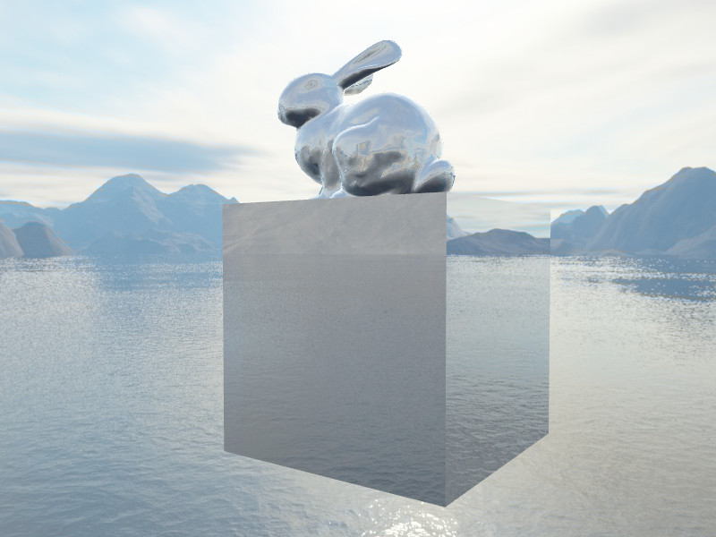
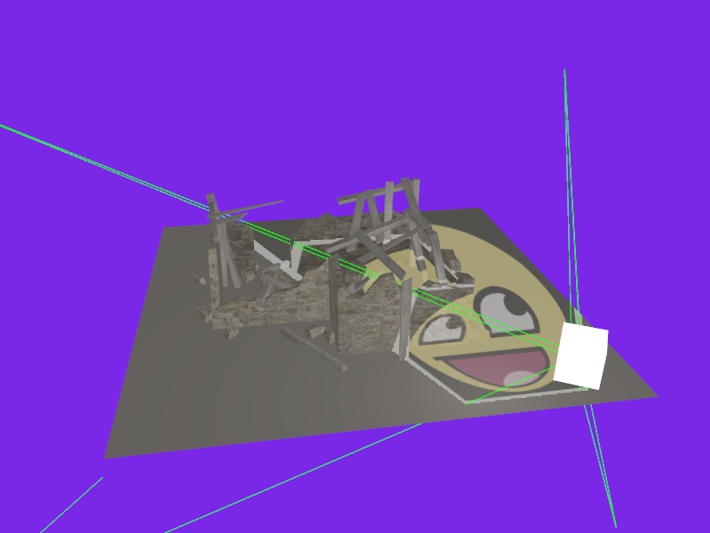
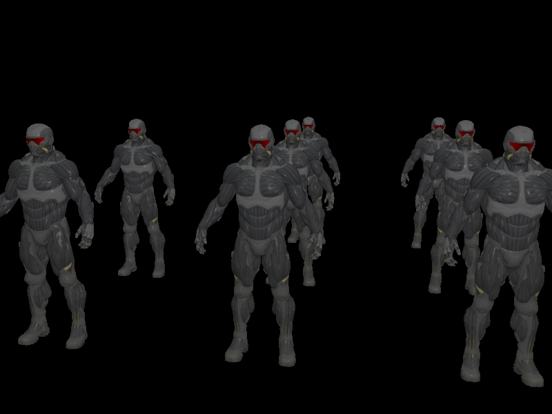

OpenGL/Glium exercises

Run all binaries from the root directory. Use mouse and w,s,a,d to look around.

### Reflection

`cargo run --bin mirror --release`

### Phong shading

`cargo run --bin crysis --release`

### Texture projection

`cargo run --bin spot --release`

### Deferred shading

`cargo run --bin army --release`

